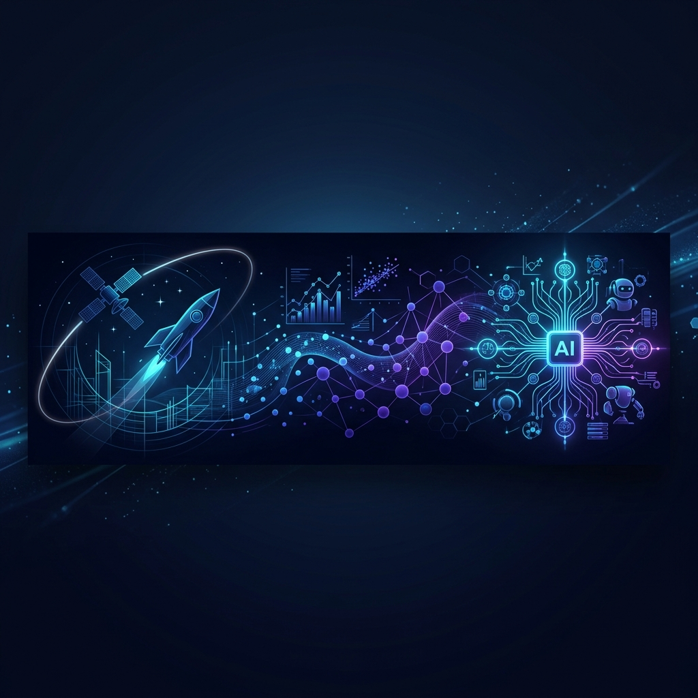

  
  
  <h1>Hi, I'm Santhi Prasanna Peesa 🚀</h1>
  <h3>Applied ML Engineer | Agentic AI Systems | UMD MS Data Science</h3>
  
  

    
    
  

---

## 🌌 About Me

My journey began in **Aerospace Engineering at IIT**, where I learned to navigate complex, non-linear problems through the lens of systems thinking and optimization. Transitioning into **Data Science at UMD**, I realized that the same mathematical rigor could be applied to statistical machine learning—turning vast amounts of noise into actionable insights.

Today, I sit at the intersection of these disciplines, building **production-grade agentic AI systems**. Large Language Models finally allow me to combine the structured systems-level thinking of aerospace with the dynamic problem-solving of ML. Whether it's orchestrating multi-agent workflows for risk analytics or optimizing 7B-to-1B LLM distillation pipelines, my goal is to architect intelligent systems that execute reliably in the real world.

---

## 🏆 Proof of Execution
- **4x Hackathon Winner**: 2x AWS International Winners, 1x UMD 3rd Place (VISTA), 1x DevRev Top 5/500+ (Voicesift)
- **Production AI**: Built multi-agent automated underwriting systems (**X-RAIL**) and SLA-aware ML scheduling on AWS EKS (**DRC-IO**).
- **Research**: Optimizing 7B-to-1B LLM post-training (multi-teacher distillation) at FORMAL Lab, UMD.

---

## 🛠️ Tech Stack
- **AI/ML Architectures:** Multi-Agent Systems, RAG, Knowledge Graphs, Knowledge Distillation
- **AI Libraries:** PyTorch, Hugging Face, LangChain, LangGraph, Scikit-learn
- **Cloud & Big Data:** AWS (SageMaker, EKS), GCP (Vertex AI), Spark, Hadoop
- **Engineering:** Python, SQL, Docker, MLflow, FastAPI, Kubernetes

---

## 📌 Featured Work

### [X-RAIL: Explainable Risk Analytics & Insights Loop](#)
*Multi-agent AI system for automated underwriting integrating fraud detection and NL-to-SQL analytics.*
- **Tech**: LangGraph, NL-to-SQL, Multi-Agent workflows.
- **Impact**: Reduced manual review time by 60–70%.

### [VISTA: Video Intelligence with Spatio-Temporal Augmented Retrieval](#)
*Spatio-temporal RAG system giving VLMs persistent memory over entities and events using optical flow.*
- **Tech**: VLMs, Graph Representations, Tool-calling.
- **Impact**: 93.3% accuracy on spatial-temporal reasoning over real construction footage.

### [DRC-IO: SLA-Aware I/O Scheduling for Real-Time ML](#)
*Kubernetes-based scheduling system to improve reliability of latency-critical ML inference services.*
- **Tech**: Docker, AWS EKS, cgroups v2, Prometheus.
- **Impact**: Reduced tail latency (P95) by 66.7% under multi-tenant I/O contention.

---

  <i>"Optimizing systems from the stratosphere to the latent space."</i>

